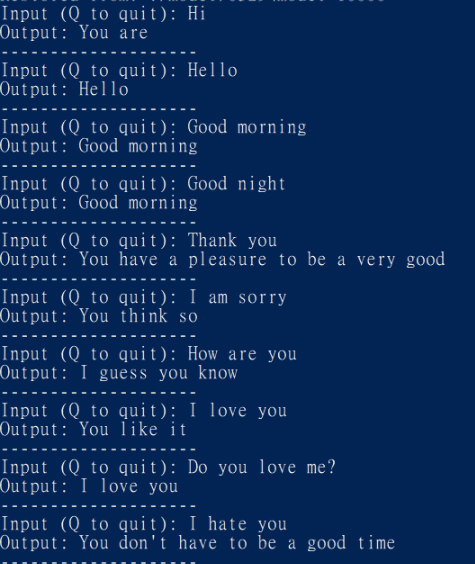
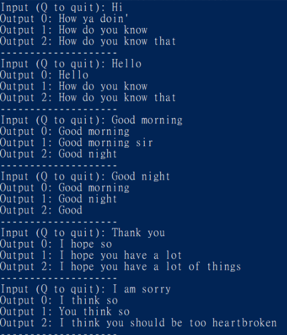
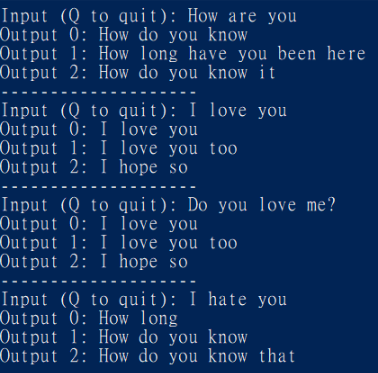

# tf-DeepQA

## Seq2Seq model for English Q&A

使用tensorflow建構一個 sequence to sequence model 來訓練一個簡易的 chatbot

使用的數據集: [Cornell Movie-Dialogs Corpus](http://www.cs.cornell.edu/~cristian/Cornell_Movie-Dialogs_Corpus.html)

此數據集蒐集了大量電影英文劇本中的對話:  
- 10292對電影人物間的220579次對話  
- 共包含617部電影中的9035個角色  
- 總共304713條台詞

這次的訓練只有使用 movie\_lines.txt 和 movie\_conversations.txt 兩個檔案  
因為我們是要train一個general的對話系統, 所以只考慮對話關係跟內容, 暫時不考慮出自哪部電影或角色等資訊

### Data preprocess

基本上就是把電影台詞斷詞, 建一個vocab dictionary以便把word轉換成id丟進model

另外, 我把出現次數太少的word捨棄以縮減dict的大小, 將那些字轉換成 UNK  
再把有 UNK 出現在回應句子的training pair移除, 確保輸出的句子能確實的計算loss

再設一個句子長度上限(我是設10), 把太長的句子剔除在外

經過上面的處理, 我留下了9萬多筆的training pair

### Seq to Seq model

對輸入做embedding

    self.embedding = tf.get_variable('embedding', [self.vocab_size, self.embedding_size])
    self.encoder_inputs = tf.nn.embedding_lookup(self.embedding, self.inputs)
    self.decoder_inputs = tf.nn.embedding_lookup(self.embedding, self.targets1)

使用了LSTM cell來建構RNN, 也加上dropout

    def get_a_cell(self, lstm_size, keep_prob):
        lstm = tf.nn.rnn_cell.BasicLSTMCell(lstm_size)
        drop = tf.nn.rnn_cell.DropoutWrapper(lstm, output_keep_prob=keep_prob)
        return drop

Encoder (Bidirectional RNN):

    # bidirectional RNN
    encoder_cell_fw = tf.nn.rnn_cell.MultiRNNCell([self.get_a_cell(self.lstm_size, self.keep_prob) for _ in range(self.num_layers)])
    encoder_cell_bw = tf.nn.rnn_cell.MultiRNNCell([self.get_a_cell(self.lstm_size, self.keep_prob) for _ in range(self.num_layers)])
    encoder_outputs, encoder_state = tf.nn.bidirectional_dynamic_rnn(encoder_cell_fw, encoder_cell_bw, self.encoder_inputs, sequence_length=self.x_seq_lengths, dtype=tf.float32)

Decoder (加入attention mechanism):

    # decoder
    decoder_cell = tf.nn.rnn_cell.MultiRNNCell([self.get_a_cell(self.lstm_size, self.keep_prob) for _ in range(self.num_layers)])
    projection_layer = tf.layers.Dense(self.vocab_size, use_bias=False)

    #attention
    attention_mechanism = tf.contrib.seq2seq.LuongAttention(self.lstm_size, self.encoder_outputs)
    decoder_cell = tf.contrib.seq2seq.AttentionWrapper(decoder_cell, attention_mechanism, attention_layer_size=self.lstm_size)
    decoder_initial_state = decoder_cell.zero_state(self.batch_size, tf.float32).clone(cell_state=self.encoder_state)

    helper = tf.contrib.seq2seq.TrainingHelper(self.decoder_inputs, self.y_seq_lengths)
    
    decoder = tf.contrib.seq2seq.BasicDecoder(decoder_cell, helper, decoder_initial_state, projection_layer)
    self.decoder_outputs, self.decoder_state, _ = tf.contrib.seq2seq.dynamic_decode(decoder, maximum_iterations=self.max_steps)

### Train

用預設參數做training, 並將model存到 0529 資料夾

    python train.py --name 0529

### Result

這個model我總共只train了10000個iteration, loss從一開始約7降到3.8左右  
因為loss還不夠低, 所以可預期表現應該不可能太好

直接載入train好的model 0529, 並做對話測試

預設使用Greedy方式選取每一步機率最高的word生成句子

    python sample.py --checkpoint_path ./model/0529 --converter_name 0529

Greedy 測試結果:

另外我也實作了 Beam Search 方法來生成句子(預設beam width為3, 會產生top3回應)

    python sample.py --checkpoint_path ./model/0529 --converter_name 0529 --beam_search True --beam_width 3

Beam Search 測試結果:

可以發現, 整體來說非常不OK...

回應的句子大致算完整, 但幾乎都沒有回應到輸入的句子, 還有極大的進步空間

而greedy和beam search相比, 因為機率取法不同, 輸出結果也會有不同

結論是, 必須將model訓練更久讓loss再降低, 才能有更好的結果

